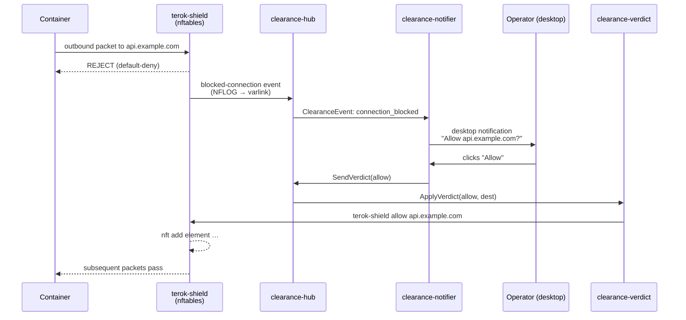

# terok-clearance

[](https://opensource.org/licenses/Apache-2.0)
[](https://api.reuse.software/info/github.com/terok-ai/terok-clearance)
[](https://sonarcloud.io/summary/new_code?id=terok-ai_terok-clearance)

Live allow/deny prompts for the terok firewall — desktop
notifications, varlink hub, verdict daemon.

When a hardened terok container hits a blocked outbound destination,
the operator sees a desktop notification with **Allow** and **Deny**
buttons; the chosen verdict is written into the running nftables
ruleset within a fraction of a second.  No restart, no shell into
the container, no editing config files.

<p align="center">
  
</p>

## What is the clearance system

The clearance system is the operator-in-the-loop decision path for
terok's egress firewall.  It is built from three small daemons that
talk over a varlink Unix socket and surface decisions through the
freedesktop Notifications D-Bus interface:



The split into three units is deliberate.  The **hub** is the
event bus and is the only daemon that needs persistent state; it
runs hardened.  The **notifier** is a thin desktop bridge that
fails gracefully on headless hosts.  The **verdict** daemon is the
only piece that calls into the container's network namespace, so
it is intentionally less constrained — keeping the privileged
surface small and isolated from the bus.

## What it provides

- **Async-first Python API** — `create_notifier()`, `Notifier`
  protocol, `DbusNotifier`, `CallbackNotifier`, `NullNotifier`
- **Varlink hub** — `ClearanceHub`, `ClearanceClient`,
  `EventSubscriber` for in-process subscribers (used by the
  TUI to render live verdicts)
- **Three systemd user units** — `terok-clearance-hub.service`,
  `terok-clearance-notifier.service`,
  `terok-clearance-verdict.service`; installable / removable via
  `install_notifier_service()` / `uninstall_notifier_service()`
- **Container metadata helpers** — `IdentityResolver`,
  `ContainerInspector`, `ContainerInfo` for resolving the source
  of a blocked event back to a named task
- **Graceful degradation** — `NullNotifier` is returned when no
  D-Bus session bus is available, so headless hosts can still run
  the rest of the stack

## Where it sits in the stack

terok-clearance is the user-in-the-loop side-rail of the terok
ecosystem.  Above it,
[terok](https://github.com/terok-ai/terok)'s TUI subscribes to the
hub to display verdicts in-band; on a desktop session the
freedesktop notifier surfaces the same events as popups.  Below it,
the verdict daemon reaches into
[terok-shield](https://github.com/terok-ai/terok-shield) to mutate
the running ruleset.  Installation and lifecycle are owned by
[terok-sandbox](https://github.com/terok-ai/terok-sandbox), which
wires the three units up at setup time.

The package is genuinely usable on its own — the notification API
and the protocol abstractions are stable enough to sit at the heart
of any desktop-driven IPC use case.

## Requirements

- Linux with a D-Bus session bus (any desktop environment with a
  notification daemon) — the package degrades cleanly to a no-op
  notifier when no bus is reachable
- Python 3.12+

## Installation

```bash
pip install terok-clearance
```

For most users this dependency is pulled in transitively by
`terok-sandbox`'s setup phase.  Install it directly only when
embedding the API in your own tooling.

## Quick start

### Send a notification

```python
import asyncio
from terok_clearance import create_notifier

async def main():
    notifier = await create_notifier(app_name="terok")
    action_received = asyncio.Event()

    def on_action(nid, key):
        print(f"{nid}: {key}")
        action_received.set()

    notifier.on_action(on_action)

    nid = await notifier.notify(
        "Clearance request",
        "Task alpha wants access to api.github.com:443",
        actions={"allow": "Allow", "deny": "Deny"},
    )

    await action_received.wait()
    await notifier.close()

asyncio.run(main())
```

### CLI tool (development / testing)

```bash
terok-clearance-notify "Title" "Body" --actions allow:Allow deny:Deny --wait
```

## Documentation

- **[User Guide](https://terok-ai.github.io/terok-clearance/)** —
  overview, quick start, API preview
- **[Developer Guide](https://terok-ai.github.io/terok-clearance/developer/)** —
  contributing, conventions, architecture

## License

Apache-2.0 — see [LICENSES/Apache-2.0.txt](LICENSES/Apache-2.0.txt).
