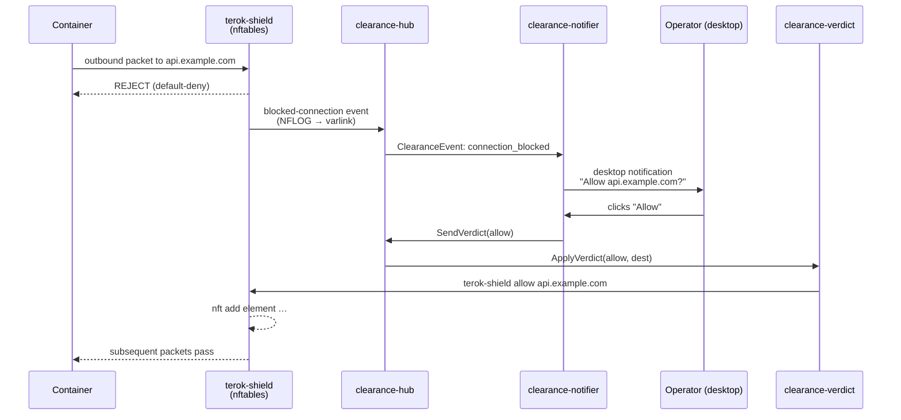

# terok-clearance

Live allow/deny prompts for the terok firewall — desktop
notifications, varlink hub, verdict daemon.

When a hardened terok container hits a blocked outbound destination,
the operator sees a desktop notification with **Allow** and **Deny**
buttons; the chosen verdict is written into the running nftables
ruleset within a fraction of a second.  No restart, no shell into
the container, no editing config files.


## What is the clearance system

The clearance system is the operator-in-the-loop decision path for
terok's egress firewall.  It is built from three small daemons that
talk over a varlink Unix socket and surface decisions through the
freedesktop Notifications D-Bus interface:



The split into three units is deliberate.  The **hub** is the
event bus and the only daemon with persistent state; it runs
hardened.  The **notifier** is a thin desktop bridge that fails
gracefully on headless hosts.  The **verdict** daemon is the only
piece that calls into the container's network namespace, so it is
intentionally less constrained — keeping the privileged surface
small and isolated from the bus.

## Key properties

- **Async-first** — built on `dbus-fast` with native asyncio
- **Action buttons** — notifications carry interactive actions
  (Allow / Deny)
- **Signal handling** — listen for `ActionInvoked` and
  `NotificationClosed`
- **Graceful fallback** — `create_notifier()` returns a silent
  `NullNotifier` when D-Bus is unavailable (headless, container, CI)
- **Protocol-based** — consumers type-hint against `Notifier`
  (PEP 544 Protocol)

## Quick start

### Install

```bash
pip install terok-clearance
```

### Send a notification

```python
import asyncio
from terok_clearance import create_notifier

async def main():
    notifier = await create_notifier(app_name="terok")
    action_received = asyncio.Event()

    def on_action(nid, key):
        print(f"{nid}: {key}")
        action_received.set()

    notifier.on_action(on_action)

    nid = await notifier.notify(
        "Clearance request",
        "Task alpha wants access to api.github.com:443",
        actions={"allow": "Allow", "deny": "Deny"},
    )

    await action_received.wait()
    await notifier.close()

asyncio.run(main())
```

### CLI tool (development / testing)

```bash
terok-clearance-notify "Title" "Body" --actions allow:Allow deny:Deny --wait
```

## API preview

| Symbol | Description |
|--------|-------------|
| `create_notifier()` | Async factory — returns `DesktopNotifier` or `NullNotifier` |
| `DesktopNotifier` | Real D-Bus client via `dbus-fast` |
| `NullNotifier` | No-op fallback (all methods return immediately) |
| `Notifier` | PEP 544 Protocol for consumer type hints |
| `ClearanceHub`, `ClearanceClient`, `EventSubscriber` | Varlink hub + subscriber API |
| `install_notifier_service()`, `uninstall_notifier_service()` | systemd unit lifecycle |

## Next steps

- [Contributing](developer.md) — development setup and conventions
- [API Reference](reference/) — full module documentation
